# Song Wars

npm run dev
localhost:3000

**Song Wars** is a full-stack web application that gamifies music sharing and discovery through competitive, tournament-style battles. Users upload their favorite songs, compete in real-time tournaments with friends or the global community, and climb the ranks on a global leaderboard.

## Features

- **Real-Time Multiplayer Tournaments** - Host or join live music battles with friends or other users
- **Song Uploads** - Upload your own songs (MP3) to compete in battles
- **Tournament Brackets** - Songs face off in head-to-head matchups until a winner is crowned
- **Ranked Mode** - Compete in global, genre-based ranked matches to improve your ELO and climb the leaderboard
- **User Profiles** - Track your stats, upload/manage your songs, and customize your profile picture
- **Global Leaderboard** - See the top 100 players by ELO rating
- **Authentication** - Secure login/register with email verification and OAuth (Google)
- **Responsive UI** - Modern, user-friendly interface with live updates

## How It Works

1. **Sign Up / Log In** - Create an account or log in using email or Google
2. **Upload Songs** - Add your favorite tracks to your profile
3. **Host or Join a Game**:
   - **Host**: Create a private game, set rules (submission time, min players), and share the code
   - **Join**: Enter a game code and your name to join a friend's game
4. **Song Submission** - Players upload a song for the tournament
5. **Tournament Bracket** - Songs are matched up in a bracket. Players listen and vote for their favorite in each round
6. **Winner** - The last song standing is declared the winner!
7. **Ranked Mode** - Play genre-based, 1v1 song battles against random users. ELO ratings are updated after each match

## Game Modes

### Private Tournament
- Host a game, invite friends, and battle songs in a live tournament
- Customizable settings: submission time, min players
- Real-time updates via Socket.IO

### Ranked Battles
- Compete in global, genre-based 1v1 song battles
- Songs are matched randomly by genre
- ELO system determines your global rank

## User Accounts & Profiles

- **Profile Page** - View and edit your profile, upload a profile picture, and manage your song library
- **Stats** - Track wins, losses, total matches, win rate, and ELO
- **Song Management** - Upload new songs, delete old ones, and see upload dates and genres

## Ranking & Leaderboards

- **ELO System** - Both users and songs have ELO ratings, which increase or decrease based on match outcomes
- **Ranks** - Users are assigned ranks (Bronze, Silver, Gold, etc.) based on ELO
- **Leaderboard** - Displays the top 100 users globally, with stats and profile pictures

## Song Management

- **Upload** - Add songs to your profile (MP3, max 10MB)
- **Genres** - Choose from a wide range of genres for each song
- **Delete** - Remove songs from your library at any time
- **Song Stats** - Each song tracks its own ELO, wins, losses, and matches

## Technology Stack

- **Backend**: Node.js, Express, MongoDB, Mongoose
- **Frontend**: Handlebars (hbs/express-handlebars), HTML, CSS, JavaScript
- **Real-Time**: Socket.IO
- **Authentication**: Passport.js (local & Google OAuth)
- **File Uploads**: Multer
- **Email**: Nodemailer (for verification)
- **Session Management**: express-session
- **Other**: bcryptjs (password hashing), dotenv, uuid

## System Architecture

```mermaid
graph TB
    User[👤 User] --> Web[🌐 Web Interface]
    Web --> Auth[🔐 Authentication]
    Web --> Upload[📁 File Upload]
    
    Auth --> DB[(🗄️ MongoDB)]
    Upload --> Storage[💾 File Storage]
    
    Web --> Express[⚡ Express Server]
    Express --> Socket[🔄 Socket.IO]
    
    Express --> Tournament[🏆 Tournament Engine]
    Express --> Ranked[📊 Ranked System]
    Express --> Profile[👤 Profile Management]
    
    Tournament --> Bracket[🎯 Bracket Logic]
    Tournament --> Voting[🗳️ Voting System]
    
    Ranked --> ELO[📈 ELO Calculator]
    Ranked --> Matchmaker[🎲 Matchmaking]
    
    Profile --> Songs[🎵 Song Library]
    Profile --> Stats[📊 User Stats]
    
    Socket --> RealTime[⚡ Real-time Updates]
    RealTime --> LiveTournaments[🔴 Live Tournaments]
    RealTime --> Notifications[🔔 Notifications]
    
    Tournament --> DB
    Ranked --> DB
    Profile --> DB
    Songs --> Storage
```

## License

This project is licensed under [insert licensce].

---

**Song Wars** is a fun, social way to discover new music, challenge your friends, and see whose songs reign supreme.
